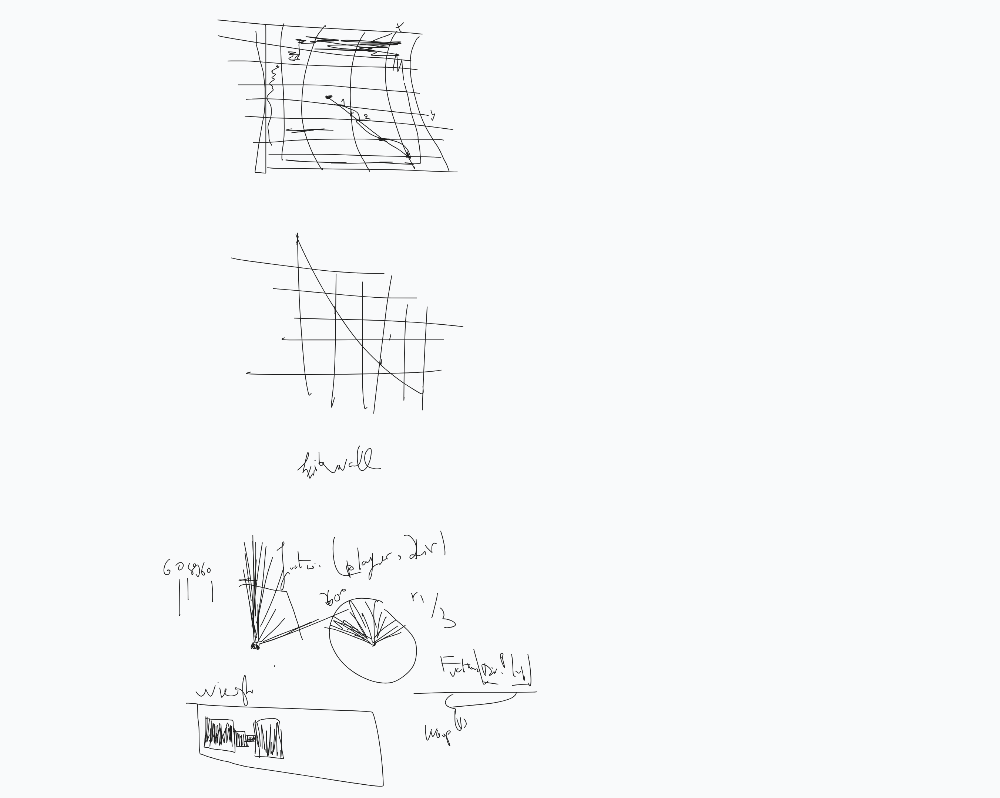
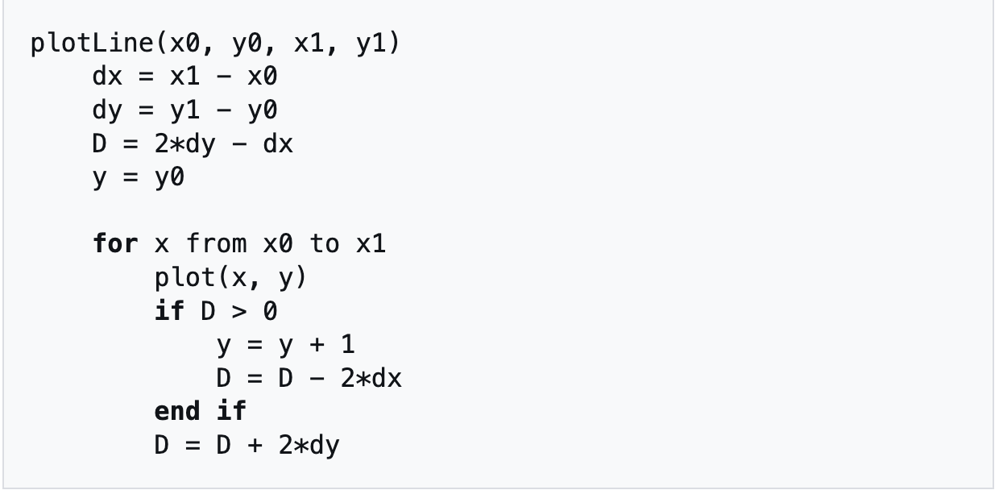

### ray
// ? the ray is getting drawn on top only in the player's tile , and under the others, the ray should be drawn in it'sown loop after the mpa is drawn  i think

i draw the ray as a rectangular block, then i position it in the middle of the player's tile, the positioning i based on the following:
{
	The map is drawn from a 2d map , the map refers to "empty space" as a "0" and walls as "1" and the player can be [N S E W].
	each tile of the map is drawn as a 32 x 32 px block in mlx and seperated by 2 pixels to form a grid .
	so the the distance between two tiles is 32 pixels, that means that i can predict that the pixels would stop by and i can use it as reference to move using pixels instead of the map.
	i need to find the equation to make this work.
	{
		what i currently have is:
		the distance between two tiles = 32 pixel;
		the starting position from where the ray is starting in the middle of the player's block = 16 therefore it should be drawn first (draw a  part fof the ray that is constant  = 18(grid included) );
		ok but how do i know that i the next block is a wall? well since i already have the map i can increment it reltiv to where i'am and the result would always match with the blocks on the pixels , so i can use the map th guide the ray.
	}
}

the player moves in four directions using arrow keys,

from what i understood from rain, i need to let the ray free and set something like a direction variable to set where it should be ? , I also need to rely on the map's grid when traversing diagonaly based on the distance between the lines of the grid, i think it's something about the fact the the ray is should continue in some parts but not in others , i guess i should take a look at DDA and some other things  for now .
.

// Ok so after watching the bersenham line video, i came to these conclusions:

1 )the way  a line is drawn is dependant on a starting and ending point. (x0, y0) (xn, ym)
2 ) the algo is a s follows.
.
wwwwwww
we first calculate the distance between the two points(deltas)

D stands for Decision parameter , where it ahelps us know which tile we are moving into in the grid in the Y axis , y or y +1.

ok so i need a way to draw a line and directly stop it a the wall.

currently im drawing from the beginning of the next pixel , if i were to keep it that way it would not wwork for me long term.

i need to make the ray go directly up the point where it should stop upon touching a wall.

ok so i implemented a prototype that can draw a line in a destiation area , however moving seems to mess it up , also cleaning up after it is messed up now.

### DDA

ok from what i undestood from the video is , that DDA works by calculating the number of steps(tile edges ) required up to the destination  ,then according to those edges it tries to check where in the map should stop when it hits a wall.

Appearently the DDA and bresenham's algorithm are just means to calculate rays distance to the walls, for us they say it's just claim that it dont matter at some point , i will see to that.

so i need to understand DDA.

i alos learned that i shouldn't modify the 2d map when moving the layer , it is computationaly expensive and it would't hel with moving the player in free form

for now i removed draw_ray im trying to draw the player as it's own entity , and updating his location whithout relying on updating the 2d map , the map is drawn only once the player should be able to move freely something like move by pixel using "speed" somehow .

the hooks should be modied to re,move the old stuff upon movement

MUST SWITCH PLAYER TO DRAW ON IT'S OWN IMAGE , change draw rectangle and other put pixels, must now define the imge v context when drawing shit
####
ok so what i can rememeber is that he player ray needs to be updated , and that requires the dest to be switched in reference to the player. here is also the issue of collision , and the DDA needs to be thoroughly tested .
###
ok so the way i used bresenham's algorithm is that it depends on a estination cooridinates, in the map pre defined  ,and that doesn't work for me  since i don't know where the ray would stop.....

wait , bresenham's algorith draws a line , right? DDA also draws a line , so i could keep bresenham_s line function to draw the line only , the problem is should i draw the ine in steps given by DDA , also the DDA does it compute the distnace in one go or in multiple times ? i know that t uses steps , but what are the relecancy of these steps  ,I NEED TO CHECK DDA NOW.

##
so the ray is in DDA is dependant on the following :

rayDirection : is where the ray moving on the x-axis and y-axis it is claculated using sin() and cos()

RayDirectionAngle: controls the rotation of the ray's direction.

Rayorigin = the starting position of the ray.

the ray is then drawn on the tile it is standing on from RayOrigin (floor is used to approximate where you are on the map)

i think i will try rotating the ray first, a good insight i found is that the The algorithm rlies on the distance between x and y from the intersctio points and dependig on the lowest one we decide which tile to color next.

calculating the cos of an angle assumes you are inside a circle and whould help you claculate the distance between you and the destination in x axis , the y-axis.

for now i need to either test with bresenham's line to control the directio or , implement DDA in  one go .

ok i got lost here for a little bit , What do i need to do ?,

i currently have the followng on my mind :

i need to fix the player's mouvement.
{
	what i know about the player's mouvement is;
	 i can move the player usig the instance coordinates that starts from 0.
	 	this whelps me move it n the window.
	i can use the 2d map to check if the player is gonna enter a lcation that contains wall.
		the map serves as a reference i can only increment the map position after i make sure that i left the previous tile.
		i order to do that i have to calculate the distance between
}

i need to set up the DDA line drawing algorithm to draw the ray .

i need to set up collision for both the player and the ray .

ok so i managed to make collision in some directuions , but it's still not working for the right and down , mouvement its offseted for some eason , somethng like the positioningplayer is not tracked correctly when moving the player up or down , soemthing about scaling or , maybe the input giving to draw player , i don't know but i know im going in the right direction , just check the map shennigans. good luck
